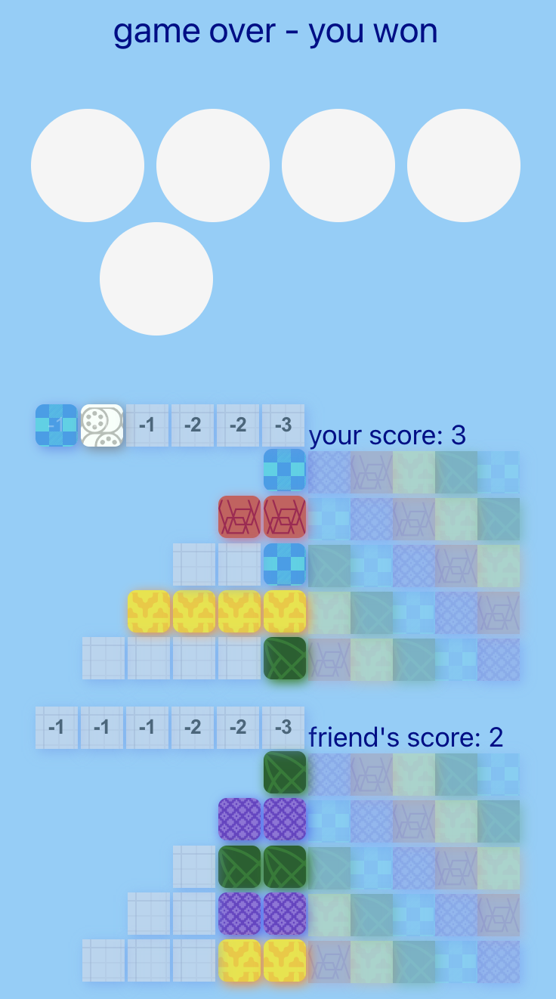

# Tiles

[try it out!](https://redslug.github.io/tiles/)



## Setup

Install and run game

```
nvm install 22
cd tiles
npm install
npm run dev
```

## Deploy

```
npm run deploy
```

## Enhancement ideas

- make it a multi 2-4 player game
- add a timer and have timeout (30 seconds)
- add celebration upon winning game
- randomly generate initial turn number to have start player be random
- bring back `<StrictMode>`
- add a browser icon
- make it default to full screen on mobile / or turn it into a mobile app
- player who picks up white tile should go first following round
